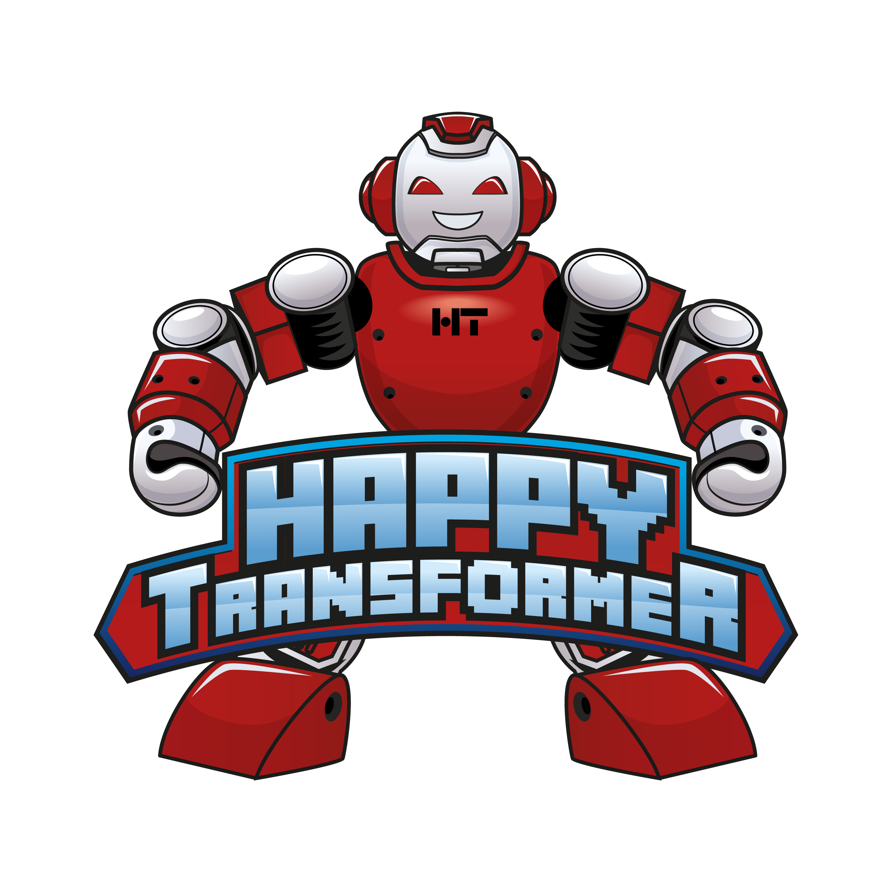

[](https://opensource.org/licenses/Apache-2.0) 
[](https://pepy.tech/project/happytransformer)
[](http://happytransformer.com)

[](https://github.com/EricFillion/happy-transformer/actions)

# Happy Transformer 
**Documentation and news: [happytransformer.com](http://happytransformer.com)**

New Course: Create a text generation web app. Also learn how to fine-tune GPT-Neo [link](https://www.udemy.com/course/nlp-text-generation-python-web-app/?couponCode=LAUNCH)


Join our Discord server: [](https://discord.gg/psVwe3wfTb)




Happy Transformer is an package built on top of [Hugging Face's transformer library](https://huggingface.co/transformers/) that makes it easy to utilize state-of-the-art NLP models. 

## Features 
  
| Public Methods                     | Basic Usage  | Training   |
|------------------------------------|--------------|------------|
| Text Generation                    | ✔            | ✔          |
| Text Classification                | ✔            | ✔          | 
| Word Prediction                    | ✔            | ✔          |
| Question Answering                 | ✔            | ✔          | 
| Text-to-Text                       | ✔            | ✔          | 
| Next Sentence Prediction           | ✔            |            | 
| Token Classification               | ✔            |            | 

## Quick Start
```sh
pip install happytransformer
```

```python

from happytransformer import HappyWordPrediction
#--------------------------------------#
happy_wp = HappyWordPrediction()  # default uses distilbert-base-uncased
result = happy_wp.predict_mask("I think therefore I [MASK]")
print(result)  # [WordPredictionResult(token='am', score=0.10172799974679947)]
print(result[0].token)  # am
```

## Maintainers
- [Eric Fillion](https://github.com/ericfillion)  Lead Maintainer
- [Ted Brownlow](https://github.com/ted537) Maintainer

## Tutorials 
[Text generation with training (GPT-Neo)](https://youtu.be/GzHJ3NUVtV4)

[Text classification (training)](https://www.vennify.ai/train-text-classification-transformers/) 

[Text classification (hate speech detection)](https://youtu.be/jti2sPQYzeQ) 

[Text classification (sentiment analysis)](https://youtu.be/Ew72EAgM7FM)

[Word prediction with training (DistilBERT, RoBERTa)](https://youtu.be/AWe0PHsPc_M)

[Top T5 Models ](https://www.vennify.ai/top-t5-transformer-models/)

[Grammar Correction](https://www.vennify.ai/grammar-correction-python/)

[Fine-tune a Grammar Correction Model](https://www.vennify.ai/fine-tune-grammar-correction/)
