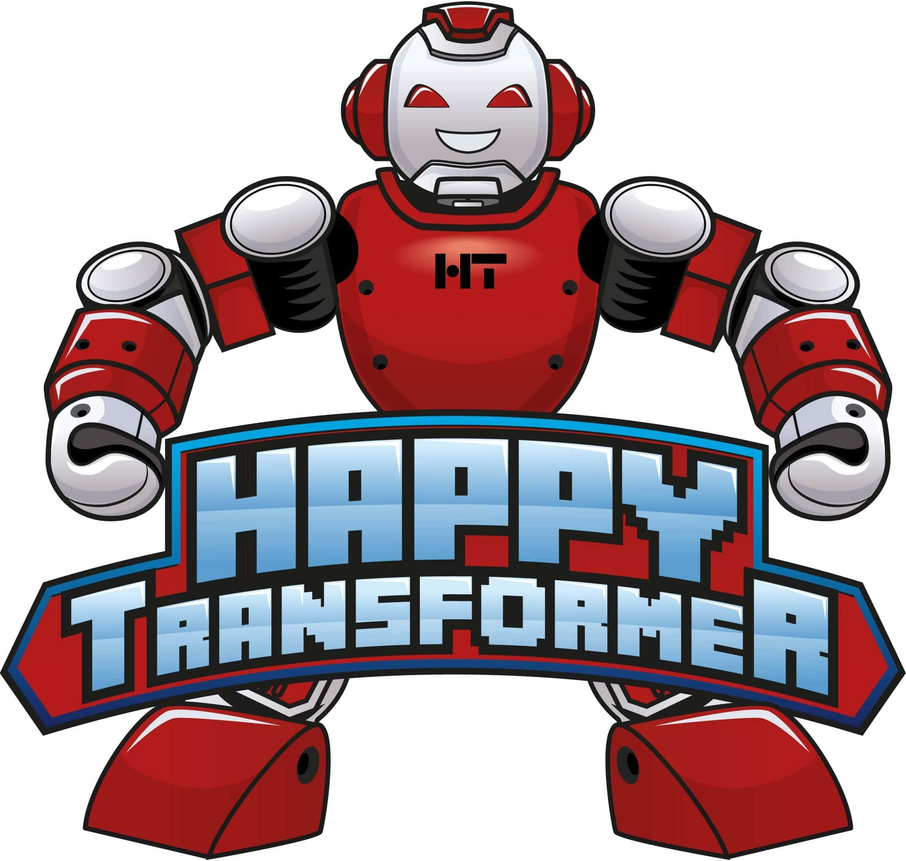

# About
Happy Transformer is a package built on top of [Hugging Face's transformer library](https://huggingface.co/transformers/) that makes it easy to utilize state-of-the-art NLP models. 

## Features 
  
| Public Methods                     | Basic Usage  | Training   |
|------------------------------------|--------------|------------|
| Text Generation                    | ✔            | ✔          |
| Text Classification                | ✔            | ✔          | 
| Question Answering                 | ✔            | ✔          | 
| Word Prediction                    | ✔            | ✔          |
| Text-to-Text                       | ✔            | ✔          | 
| Token Classification               | ✔            |            | 
| Next Sentence Prediction           | ✔            |            | 

[GitHub](https://github.com/EricFillion/happy-transformer){: .btn .mr-30 }

[PyPI](https://pypi.org/project/happytransformer/){: .btn }

[Discord](https://discord.gg/psVwe3wfTb){: .btn }

## Courses

[Create a text generation web app. Also learn how to fine-tune GPT-Neo](https://www.udemy.com/course/nlp-text-generation-python-web-app/?couponCode=LAUNCH)

## Free Tutorials 
[Text classification (training)](https://www.vennify.ai/train-text-classification-transformers/) 

[Text classification (hate speech detection)](https://youtu.be/jti2sPQYzeQ) 

[Text classification (sentiment analysis)](https://youtu.be/Ew72EAgM7FM)

[Text generation with training (GPT-Neo)](https://youtu.be/GzHJ3NUVtV4)

[Word prediction with training (DistilBERT, RoBERTa)](https://youtu.be/AWe0PHsPc_M)